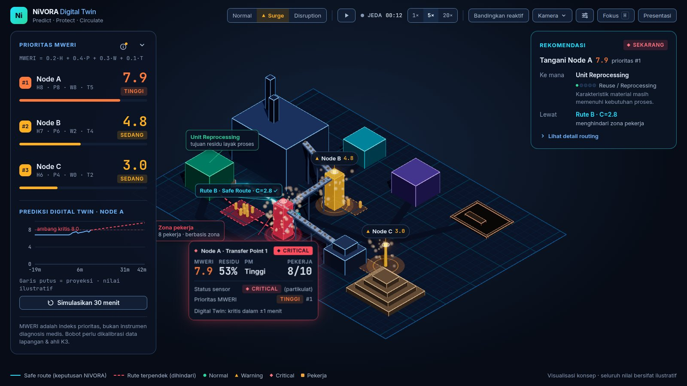
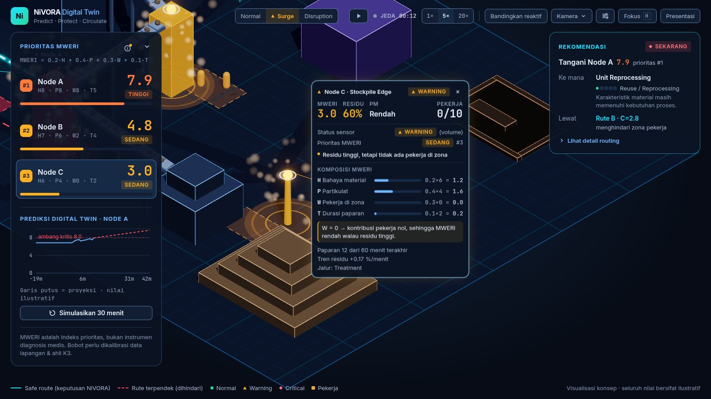
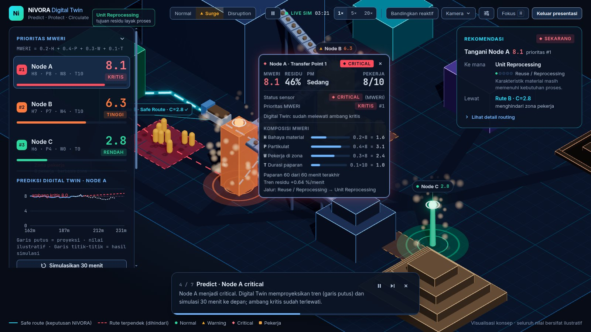
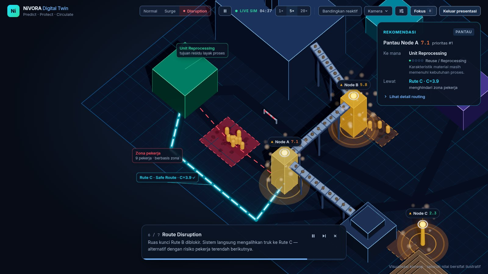
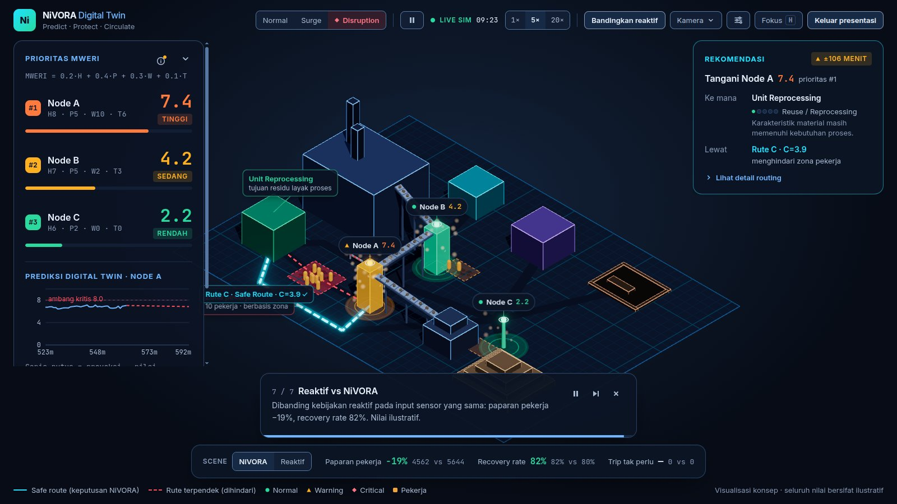

# NiVORA — Human-Centric Digital Twin untuk Pengelolaan Residu Nikel

Prototype web 3D interaktif dari konsep esai IOSH Summit 2026 (subtema *Digitalisasi Lingkungan*).
NiVORA memperlihatkan paradigma **Predict – Protect – Circulate**: sistem tidak hanya bertanya
*seberapa banyak* residu menumpuk, tetapi *di mana pekerja paling terpapar* — lalu merekomendasikan
**kapan** menangani, **seberapa prioritas**, **ke mana** residu dibawa, dan **lewat rute mana**.

> **Visualisasi konsep — seluruh nilai bersifat ilustratif.** Bukan sistem produksi, bukan integrasi
> sensor fisik, dan MWERI bukan instrumen diagnosis medis.



## Yang diperlihatkan

| Pilar | Di layar |
|---|---|
| **Predict** | Tiga NiVORA Node (partikulat, level residu, keberadaan pekerja). Edge-AI (rule-based mock) memberi status *Normal / Warning / Critical*; Digital Twin memproyeksikan kapan node menjadi kritis (regresi 20 sampel terakhir). |
| **Protect** | **MWERI** (Mining Waste Exposure Risk Index) memprioritaskan node menurut risiko paparan pekerja — bukan volume residu. |
| **Circulate** | **Circular Material Decision Pathway** memilih jalur residu, lalu **graph-based safe routing** (Dijkstra, biaya komposit) memilih rute pengangkutan yang memutari zona pekerja. |

Pesan kunci esai — **Node C**: residunya tertinggi, tetapi MWERI-nya terendah karena tidak ada
pekerja di zonanya. Sistem berbasis volume akan mendahulukannya; NiVORA tidak.



## Presentasi otomatis (60 detik)

Tombol **Presentasi** di TopBar menjalankan tur di layar penuh dengan seed tetap (hasilnya selalu sama):

1. **Overview** — pabrik dan tiga node.
2. **Normal Operation** — pemantauan rutin.
3. **Production Surge** — produksi 1,8×, partikulat naik.
4. **Node A critical** — kamera fokus, prediksi & simulasi 30 menit tampil.
5. **Pathway & safe route** — Reuse / Reprocessing lewat Rute B yang memutari zona pekerja.
6. **Route Disruption** — ruas kunci diblokir, truk dialihkan ke Rute C.
7. **Reaktif vs NiVORA** — ringkasan KPI pada input sensor yang identik.

Kontrol tur: jeda, lewati, keluar (atau **Esc**).

| Node A critical | Route Disruption | Reaktif vs NiVORA |
|---|---|---|
|  |  |  |

## Menjalankan

Butuh **Node.js ≥ 20.19** (lihat `engines` di `package.json`).

```bash
npm install
npm run dev        # http://localhost:5173
npm test           # vitest — logika simulasi, routing, view model, naskah tur
npm run build      # typecheck + build produksi ke dist/
npm run preview    # menyajikan dist/ secara lokal
npm run lint
```

Semuanya berjalan di browser — tanpa backend, tanpa unduhan saat runtime (font di-self-host), sehingga
demo tetap jalan offline.

### Kontrol

| Kontrol | Fungsi |
|---|---|
| Skenario (TopBar) | Normal · Surge · Disruption |
| ▶ / 1× 5× 20× | Jalankan/jeda simulasi; 1× = 1 menit simulasi per detik |
| **Bandingkan reaktif** | Menampilkan strip KPI NiVORA vs kebijakan reaktif + pemilih scene |
| Kamera ▾ | Overview · Fokus Node A · Rute |
| ⚙ | Slider bobot MWERI & biaya rute (Σ = 1 dijaga otomatis) |
| **Fokus** · tombol `H` | Sembunyikan semua panel kecuali kartu Rekomendasi |
| Klik node / pill | Kamera fokus + kartu detail (komposisi MWERI); `Esc` menutup |
| Simulasikan 30 menit | What-if: fork engine tanpa mengubah kondisi saat ini |

Halaman debug engine (tabel state per tick): `/#debug`.

## Model & angka (sesuai lampiran esai)

**MWERI** — `MWERI = wH·H + wP·P + wW·W + wT·T`, bobot default `0.2 · 0.4 · 0.3 · 0.1`.
Lampiran 4: Node A = **8.4**, Node B = **5.1**, Node C = **2.6** (diuji dengan toleransi 1e-9).

**Safe routing** — `C = α·D + β·R + γ·O`, bobot default `0.3 · 0.5 · 0.2`.
Lampiran 7: Rute A (terpendek) = **5.7**, Rute B (safe) = **2.8**, Rute C = **3.9**. Dijkstra memilih B;
bila ruas B diblokir, memilih C. `R` dihitung ulang tiap tick dari jumlah pekerja di zona yang dilewati.

**Pathway** — Reuse / Reprocessing → Repurpose / Recycle → Recovery → Treatment → Safe Disposal
(berhenti di tahap pertama yang layak).

**Reaktif vs NiVORA** — engine reaktif berjalan paralel dengan seed dan derau sensor yang sama;
yang berbeda hanya kebijakan (reaktif: tangani saat residu ≥ 90 % atau terjadwal, rute terpendek).
Perbedaan KPI murni berasal dari kebijakan penanganan.

Data pekerja hanya berbasis zona (jumlah per zona, tanpa identitas).

## Arsitektur singkat

```
src/
├─ config/    data pabrik, bobot, ambang, skenario, glosarium UI (i18n)
├─ sim/       fungsi murni: engine (tick 1 menit, RNG seeded), MWERI, Edge-AI, Digital Twin,
│             pathway, routing (Dijkstra), sensor, KPI — tanpa React/Three, diuji vitest
├─ store/     zustand: dua engine (NiVORA + reaktif), jam simulasi, state tampilan, tur
├─ scene/     React Three Fiber: geometri statis digabung, debu (shader), pekerja (instancing),
│             rute, truk, label & kartu node yang diproyeksikan per frame
├─ ui/        panel overlay + view model murni (diuji)
└─ demo/      naskah presentasi otomatis 60 detik
```

Keputusan teknis dan alasannya tercatat di [`CLAUDE.md` §13](CLAUDE.md#13-keputusan-teknis);
spesifikasi visual di [`docs/design-system.md`](docs/design-system.md).

**Performa terukur** (laptop dengan GPU terintegrasi AMD Radeon, 1600×900): ±56–60 fps,
±70 draw call per frame; rata-rata 58 fps selama presentasi 60 detik.

## Deploy ke Vercel

Konfigurasi sudah disiapkan di [`vercel.json`](vercel.json) (framework Vite, `npm ci`,
`npm run build`, keluaran `dist/`, cache permanen untuk `/assets/*`).

1. Impor repositori di <https://vercel.com/new> — pengaturan terbaca otomatis dari `vercel.json`.
2. Atau dari terminal: `npx vercel` (pratinjau) lalu `npx vercel --prod`.

Tidak ada environment variable yang dibutuhkan.

## Batasan

- Seluruh angka, posisi, dan dinamika sensor **ilustratif**; bobot MWERI perlu dikalibrasi data
  lapangan & ahli K3.
- Edge-AI adalah aturan ambang (*rule-based mock*), bukan model terlatih.
- Target layar desktop ≥ 1280 px (panel dapat dilipat di bawahnya); tidak ada versi mobile.
